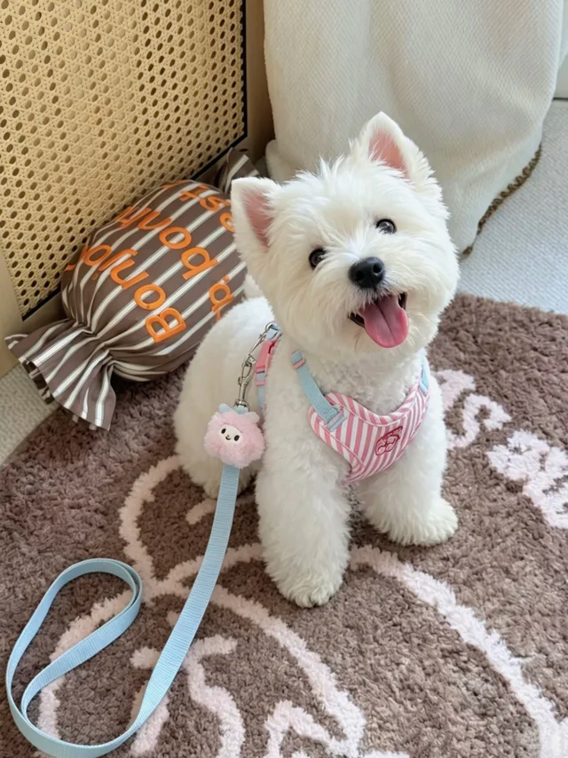
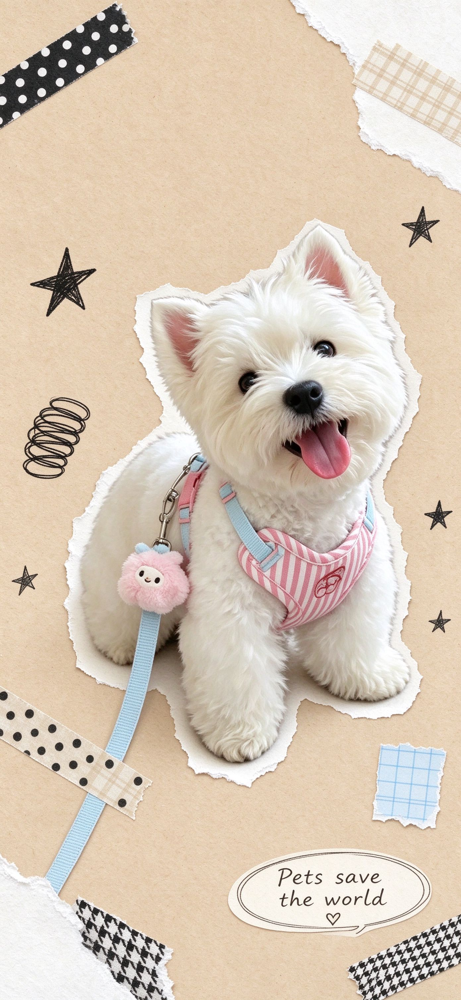
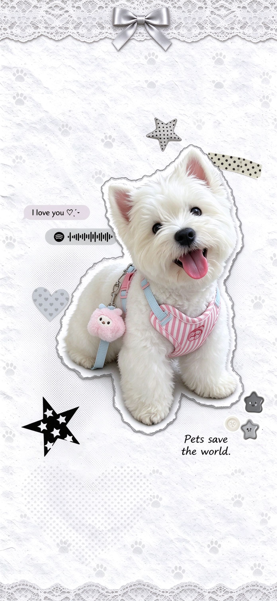
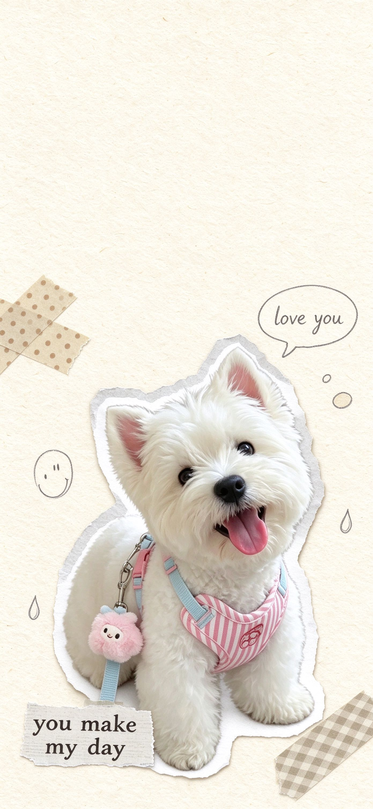

# 韩系宠物拼贴壁纸 / korean-pet-wallpaper

根据用户上传的宠物照片，生成韩系手帐拼贴风格的手机壁纸。保留宠物真实摄影质感，通过撕纸边缘、胶带、星星、蕾丝、便签等装饰元素营造手工拼贴感。

## 效果展示

原图：



三种风格效果对比：

| A 便签撕纸 | B 韩系撕纸 | C 奶油胶带 |
|---|---|---|
|  |  |  |

## 风格说明

目前支持三种风格：

### A 便签撕纸

- **特点**：暖米色纸底，撕纸边缘，胶带/星星/线圈/便签围绕主体
- **配色**：黑白灰 + 暖米色
- **适合**：单张各种形态（特写/全身均可）
- **设计原则**：装饰紧凑围绕主体，便签底色呼应宠物衣服主色

### B 韩系撕纸

- **特点**：白色纤维纸底，上下蕾丝花边+蝴蝶结，装饰元素按比例围绕主体
- **配色**：白灰黑 + 银色缎面，冷色调
- **适合**：单张头像、半身、完整姿态
- **设计原则**：主体下移至 60%-65%，顶部留足锁屏时钟安全区

### C 奶油胶带

- **特点**：暖奶油色纸底，大面积留白，胶带+铅笔涂鸦+剪报文字
- **配色**：奶油/燕麦/米灰
- **适合**：单张，偏简洁锁屏
- **设计原则**：极简风格，大留白，不喧宾夺主

## 通用设计原则

- **主体优先**：宠物照片是核心，装饰围绕主体紧凑分布，不喧宾夺主
- **自适应布局**：装饰位置和大小按主体宽度百分比计算，适配不同比例的宠物照片
- **锁屏安全区**：顶部预留 30%-35% 留白，避免锁屏时钟遮挡宠物主体
- **无系统 UI**：生成结果不会包含时间、电量、WiFi 等状态栏元素

## 文件结构

```
korean-pet-wallpaper/
├── SKILL.md              # 技能主文件，定义整体工作流
├── README.md
├── .gitignore
├── agents/
│   └── openai.yaml       # 界面元数据配置
├── assets/
│   ├── lace-paper/       # B 风格装饰素材（PNG 透明底）
│   └── demo/             # 效果展示图
│       ├── original.jpg
│       ├── style-a.jpg
│       ├── style-b.jpg
│       └── style-c.jpg
├── references/
│   ├── heart-doodle.md   # A 风格配方
│   ├── lace-paper.md     # B 风格配方
│   ├── cream-tape.md     # C 风格配方
│   ├── photo-and-identity.md  # 照片选择与身份规则
│   ├── generation-and-quality.md  # 生成与质量检查规范
│   ├── reference-index.json   # 参考图索引
│   └── images/           # 风格参考图
└── scripts/
    └── audit_outputs.py  # 输出图片技术检查脚本
```

## 使用方式

上传一张或多张宠物照片，指定风格即可生成壁纸。未指定风格时会自动推荐合适的风格。

## 说明

- 生成式 AI 输出存在随机性，同一张照片多次生成会有细微差异
- 本技能不提供逐像素保真的原照抠图合成，依赖内置图片生成能力
- 所有参考图仅用于版式和风格参考，不会将参考宠物当作用户宠物
